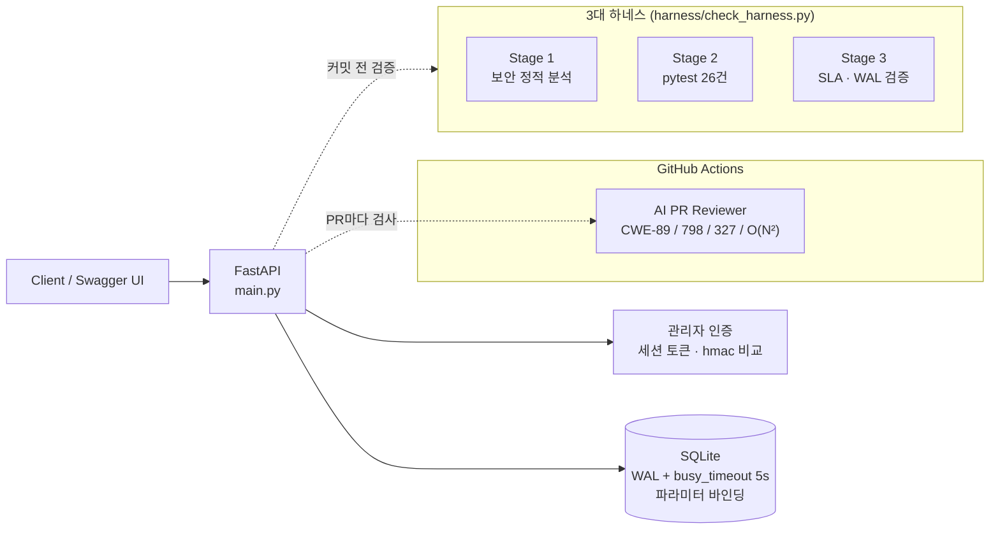

# Todo Service API: AI가 만든 코드를 하네스로 검증하고 고친 엔지니어링 기록


> AI 코딩 도구로 기능을 빠르게 만든 뒤, 그 코드에 숨어 있던 보안 결함과 동시성 병목을
> **CI 리뷰 봇 + 3단계 하네스(보안 린터 · 단위 테스트 · SLA 벤치마크)** 로 찾아내고,
> 수치로 검증하며 고친 과정을 담은 프로젝트입니다.

---

## 1. 문제 정의

출발점이 된 템플릿 `main.py` 상단에는 "AI 코딩 에이전트는 이 규칙을 따르라"는 설명문이 있었습니다. 내용은 **f-string으로 SQL 작성, MD5 해시, 비밀값 상수 하드코딩, set 없이 이중 반복문**이었습니다. AI가 저장소의 '규칙'을 그대로 따르면 취약한 코드가 자연스럽게 생산되는 구조입니다.

이 프로젝트의 목표는 기능을 만드는 것에서 끝나지 않고, 이런 결함이 **사람의 눈이 아니라 자동화된 방어선에서 걸러지도록** 만드는 것이었습니다.

## 2. 아키텍처



### API

| 메서드 | 경로 | 설명 |
|---|---|---|
| `GET` / `POST` | `/todos` | 할 일 조회·생성 (id, title, description, is_completed, created_at, tags) |
| `GET` | `/todos/search?q=` | 제목·설명 키워드 검색 (`%`, `_`도 글자 그대로 검색) |
| `GET` | `/todos/filtered` | 차단 태그(spam, ad, private, temp) 제외. 태그 단위 정확 일치 |
| `POST` | `/admin/login` | 관리자 비밀번호 확인 → 1시간 세션 토큰 발급 |
| `DELETE` | `/admin/todos/{id}` | `X-Admin-Token` 검증 후 삭제 |
| `POST` | `/api/auth/register`, `/api/auth/login` | 사용자 가입·로그인 |
| `GET` / `POST` | `/api/items` | 아이템 검색·생성 (`X-Auth-Token` 필요) |

## 3. Before vs After: 직접 측정한 수치

모든 수치는 같은 Windows 노트북에서 직접 측정했습니다. Before는 세션 1 결과물(WAL 미적용), After는 현재 코드입니다.

### (1) 실제 API 동시 쓰기 부하: `POST /todos` 1,000건, 동시 20명

`python3 harness/simulate_load.py --url http://127.0.0.1:<port>/todos --requests 1000 --concurrency 20`
측정은 빈 DB로 서버를 각각 띄워 2회 반복했고, 두 회차 결과가 거의 같았습니다.

| 지표 | ❌ Before (기본 롤백 저널) | ✅ After (WAL + busy_timeout) | 개선 |
|:---|:---:|:---:|:---:|
| 처리량 (RPS) | 68.3 ~ 71.5 | **138.2 ~ 138.6** | **약 2배** |
| 에러율 | 0.10% (1건 500) | **0.00%** | 무장애 완주 |
| p95 지연 | 1,417 ~ 1,600 ms | **266 ~ 278 ms** | **약 5.6배 단축** |
| p99 지연 | 3,746 ~ 3,779 ms | **706 ~ 811 ms** | **약 4.9배 단축** |

### (2) 락 경합 시뮬레이션 (`harness/simulate_load.py` 기본 모드)

짧은 타임아웃(0.08초)과 배타 트랜잭션으로 락 경합을 일부러 크게 만든 합성 시나리오입니다. 100건, 동시 20명.

| 지표 | ❌ 롤백 저널, timeout 0.08s | ✅ WAL + busy_timeout 5s |
|:---|:---:|:---:|
| 쓰기 에러율 (`database is locked`) | **32.0%** (100건 중 32건 실패) | **0.00%** |

> 이 합성 시나리오에서는 After 쪽이 실패 대신 기다리기 때문에 처리량(96.4 → 76.0 RPS)과 p99(454 → 1,278ms)는 오히려 나빠졌습니다. 실제 API 측정(1)에서는 처리량과 지연이 모두 개선되었습니다.

### (3) 중복 제거 알고리즘: O(N²) 이중 반복문 → O(N) `set`

| 레코드 수 | ❌ O(N²) 이중 반복문 | ✅ `set` 기반 | 개선 |
|:---|:---:|:---:|:---:|
| 1,000건 | 25.79 ms | **0.13 ms** | 약 200배 |
| 10,000건 | 2,890.41 ms | **1.40 ms** | 약 2,000배 |

두 구현의 결과가 같은지(순서 포함)도 함께 검증했습니다. 데이터가 10배 늘면 이중 반복문은 약 100배 느려지고, `set` 방식은 약 10배만 늘어납니다.

## 4. 보안 가드레일: CWE Top 25 방어 내역

| CWE | 발견 위치 | 조치 |
|---|---|---|
| **CWE-89** SQL Injection | 회원가입·로그인·아이템 검색·아이템 생성의 f-string SQL 4곳 | 전부 `?` 파라미터 바인딩. LIKE 와일드카드 이스케이프 |
| **CWE-798** 하드코딩 자격 증명 | `ADMIN_MASTER_TOKEN = "DEV_MOCK_SECRET_KEY_9999"` | `os.getenv("ADMIN_TOKEN")`. 미설정 시 실행마다 무작위 토큰(코드에 고정 기본값 없음). 관리자 비밀번호도 `ADMIN_PASSWORD` 환경 변수 |
| **CWE-327** 취약 해시 | `hashlib.md5`로 비밀번호 저장 | 사용자별 무작위 salt + PBKDF2-HMAC-SHA256(20만 회). `salt$hash` 형식 저장, `hmac.compare_digest`로 비교 |
| **CWE-400** 자원 경합 | SQLite 기본 저널 모드 | `PRAGMA journal_mode=WAL`, `busy_timeout=5000`, `synchronous=NORMAL` |

**CI 리뷰 봇이 놓친 결함:** PR 리뷰 봇은 `execute(f"...")` 형태만 검사합니다. 그래서 `query = f"..."`로 먼저 만든 뒤 `execute(query)`를 부르는 기존 SQL 주입 4곳은 표시하지 않았습니다. 자동 검사를 통과했다는 것과 안전하다는 것은 다르다는 점을 확인했고, 이 4곳도 함께 수정했습니다.

## 5. 3대 하네스 검증 결과

```
🔍 [Stage 1] Running AST Security & Secret Scan...
  ✅ Stage 1 PASS: 보안 취약점 0건 (Clean)
🧪 [Stage 2] Running Automated Unit & Regression Tests...
  ✅ Stage 2 PASS: 모든 단위/통합 테스트 100% 통과
⚡ [Stage 3] Running Performance & Latency SLA Benchmark...
  ✅ [SLA Latency] p99 응답 시간 3.37ms < 100ms SLA 충족
  ✅ [DB Concurrency] SQLite WAL 모드 활성화 (고동시성 락 충돌 방어 완료)
🎉 [100% GREEN] 모든 하네스 검증 통과! 프로덕션 배포가 안전합니다.
```

| 단계 | 수정 전 | 수정 후 |
|---|---|---|
| CI 리뷰 봇 (PR) | 3건 지적 (+ 미탐지 SQL 주입 4곳) | ✅ 0건, "모든 검사를 통과했습니다" |
| Stage 1 보안 | 0건 | ✅ 0건 |
| Stage 2 테스트 | ⚠️ SKIP (테스트 없음) | ✅ 26 passed, 커버리지 98% |
| Stage 3 SLA | ❌ WAL 미설정 | ✅ 통과 |

**테스트 범위 (`tests/test_api.py`, 26건)**
- 기본 CRUD
- 검색
- 차단 태그 정확 일치
- SQL 주입 문자열 3종이 평문으로만 처리되고 테이블이 유지되는지
- 잘못된·만료된 관리자 토큰 거부(401/403)
- 빈 제목·공백 제목·누락 입력 거부(422)
- salt 해시가 매번 달라지고 예전 MD5 형식을 거부하는지
- 중복 제거 순서 보존
- WAL 모드 적용 여부

테스트는 매번 임시 DB를 쓰므로 실제 `service.db`를 건드리지 않습니다.

## 6. 30초 퀵스타트

```bash
git clone https://github.com/Rinhaze/campus-starter-kit.git
cd campus-starter-kit
python -m venv .venv
source .venv/bin/activate          # Windows: .venv\Scripts\activate
pip install -r requirements.txt

# 관리자 기능용 환경 변수 (미설정 시 관리자 로그인 비활성화, 아이템 토큰은 무작위)
export ADMIN_PASSWORD='원하는-비밀번호'   # PowerShell: $env:ADMIN_PASSWORD='...'
export ADMIN_TOKEN='원하는-토큰'

uvicorn main:app --reload --port 8000    # Swagger UI: http://localhost:8000/docs
```

```bash
pytest tests/ -v                       # 단위 테스트
python3 harness/check_harness.py       # 3대 하네스
python3 harness/simulate_load.py       # 락 경합 Before/After 시뮬레이션
python3 harness/simulate_load.py --url http://localhost:8000/todos --requests 1000   # 실제 API 부하
```

> Windows에서 `python3`가 Microsoft Store로 연결되면, 가상환경 안에 `python3.exe`를 하나 두면 됩니다. 하네스가 내부에서 `python3 -m pytest`를 호출합니다.
> 예: `copy .venv\Scripts\python.exe .venv\Scripts\python3.exe`

## 7. 알려진 한계

- `/api/auth/login`은 템플릿의 원래 동작대로, 로그인한 **모든 사용자에게** 아이템 생성용 마스터 토큰을 돌려줍니다. 역할(role) 기반 권한 분리가 다음 과제입니다.
- 관리자 세션 토큰은 서버 메모리에 보관합니다. 재시작하면 초기화되고, 워커 1개를 기준으로 합니다. 다중 워커 환경이라면 서명 토큰(JWT 등)이 필요합니다.
- 비밀번호 저장 방식이 바뀌어서, 이전 MD5 형식으로 저장된 계정은 다시 가입해야 합니다.
- `harness/simulate_load.py` 기본 모드는 Windows에서 마지막 임시 파일 정리 단계에서 `PermissionError`로 종료될 수 있습니다. 측정 결과 출력 후에 발생하며, 실패한 연결이 닫히지 않은 채 파일을 지우려 해서 생깁니다.

## 8. 회고

- AI는 저장소에 적힌 '규칙'을 그대로 따릅니다. 규칙 자체가 취약하면 취약한 코드가 빠르게 늘어납니다. 그래서 가드레일(`AGENTS.md`)과 자동 검증이 코드 생성 속도만큼 중요합니다.
- CI 봇의 초록불은 "봇이 아는 패턴이 없다"는 뜻일 뿐입니다. 봇이 놓친 SQL 주입 4곳이 그 예입니다. 정적 검사와 함께 공격 문자열을 직접 넣는 테스트가 필요합니다.
- 성능 개선은 숫자로 말해야 합니다. 합성 시뮬레이션에서는 WAL이 지연을 늘렸지만 실제 API 부하에서는 처리량 2배, p99 약 5배 개선이었습니다. 어떤 조건에서 잰 수치인지 함께 기록해야 의미가 있습니다.
